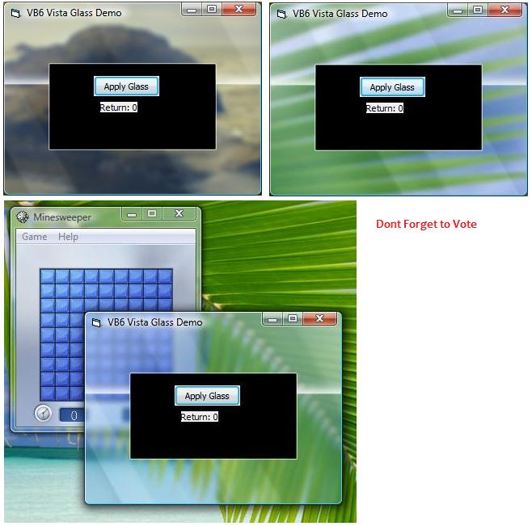



## Using Windows Vista Aero Glass Interface in VB6 Apps

### Description

This code shows you how to use Windows Vista Glass Interface in VB6.

Note: You need Windows Vista to use this App.

Dont forget to Vote.
 
### More Info
 

             |
---                |---
**Submitted On**   |2007-02-08 09:30:18
**By**             |[Abhishek\.NET](https://github.com/Planet-Source-Code/PSCIndex/blob/master/ByAuthor/abhishek-net.md)
**Level**          |Beginner
**User Rating**    |3.6 (36 globes from 10 users)
**Compatibility**  |VB 4\.0 \(32\-bit\), VB 5\.0, VB 6\.0
**Category**       |[Graphics](https://github.com/Planet-Source-Code/PSCIndex/blob/master/ByCategory/graphics__1-46.md)
**World**          |[Visual Basic](https://github.com/Planet-Source-Code/PSCIndex/blob/master/ByWorld/visual-basic.md)
**Archive File**   |[Using\_Wind204697282007\.zip](https://github.com/Planet-Source-Code/abhishek-net-using-windows-vista-aero-glass-interface-in-vb6-apps__1-67823/archive/master.zip)

